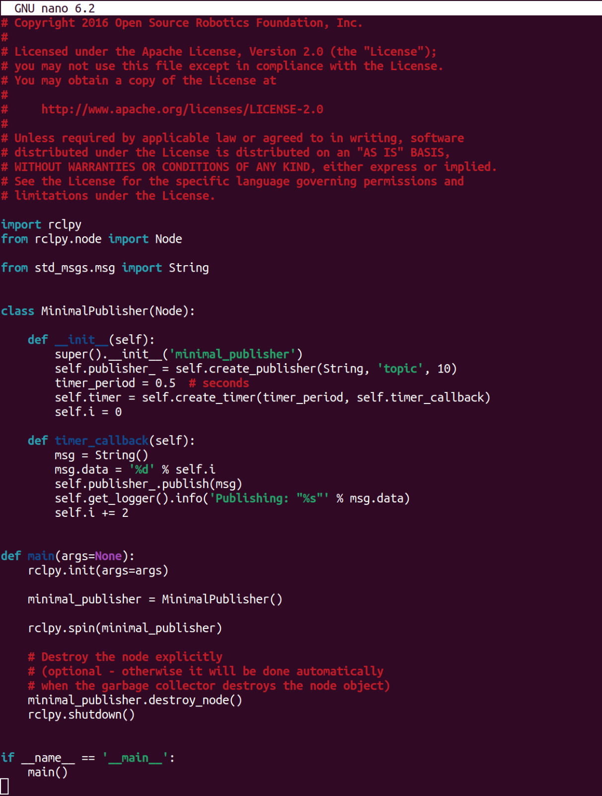
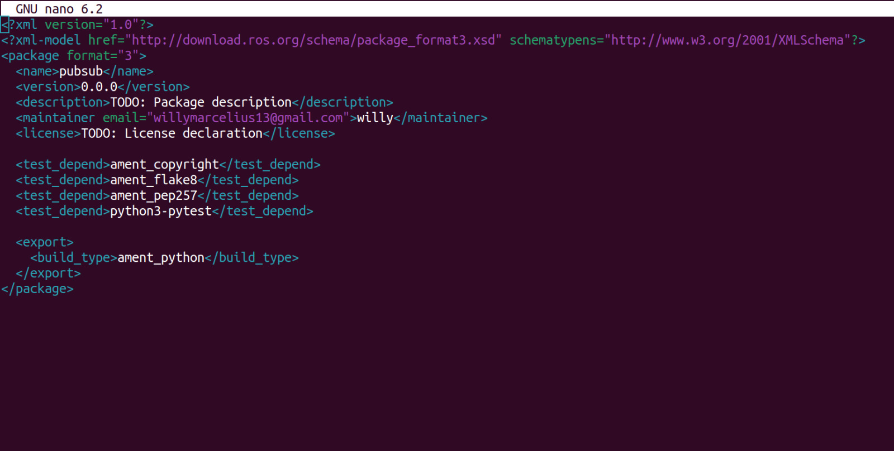
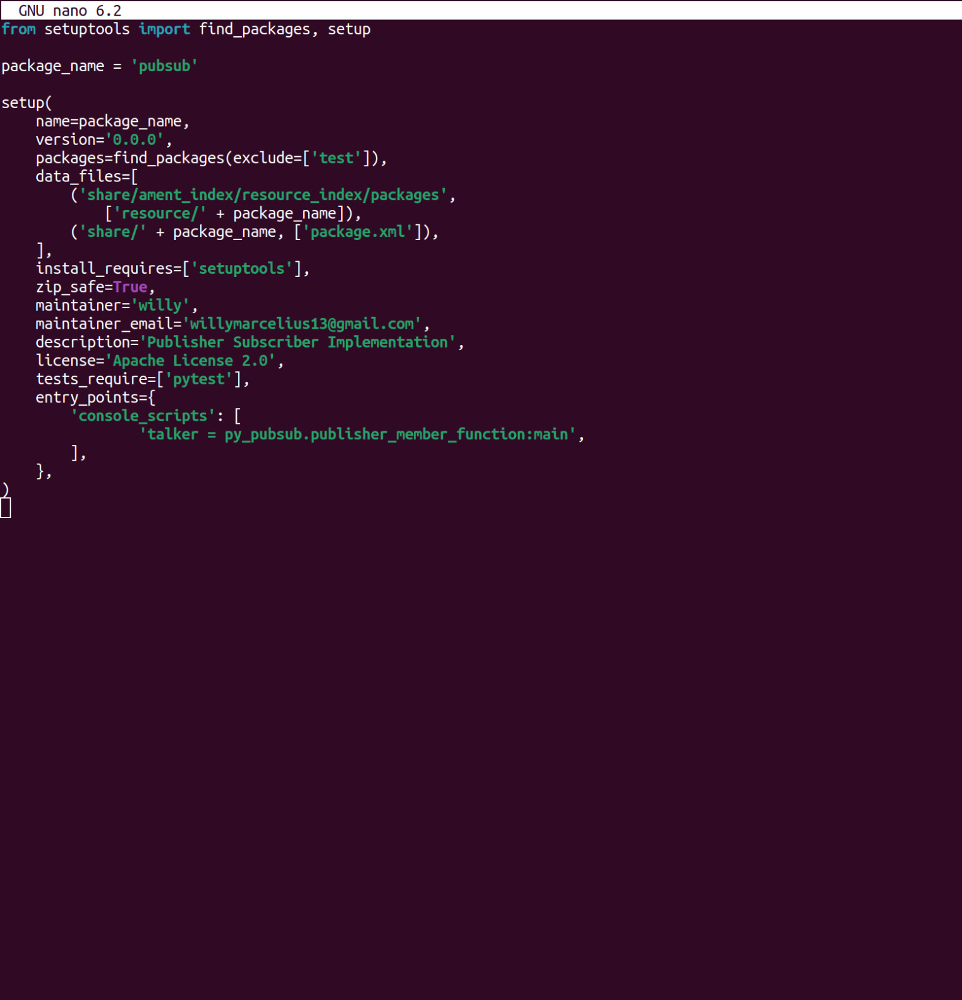
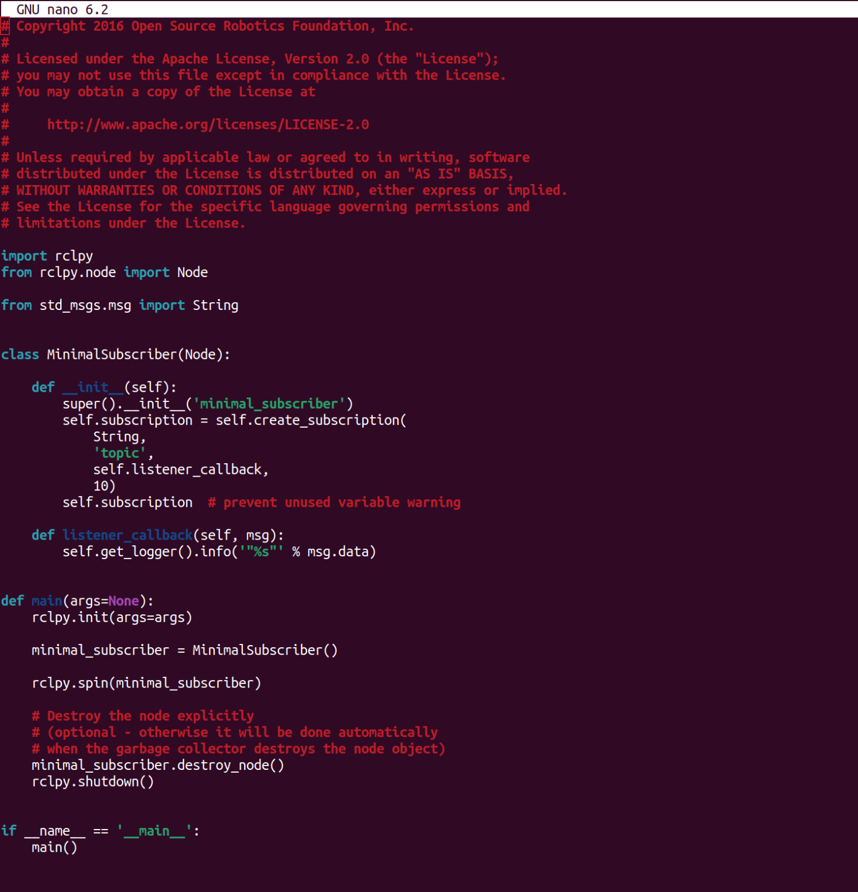
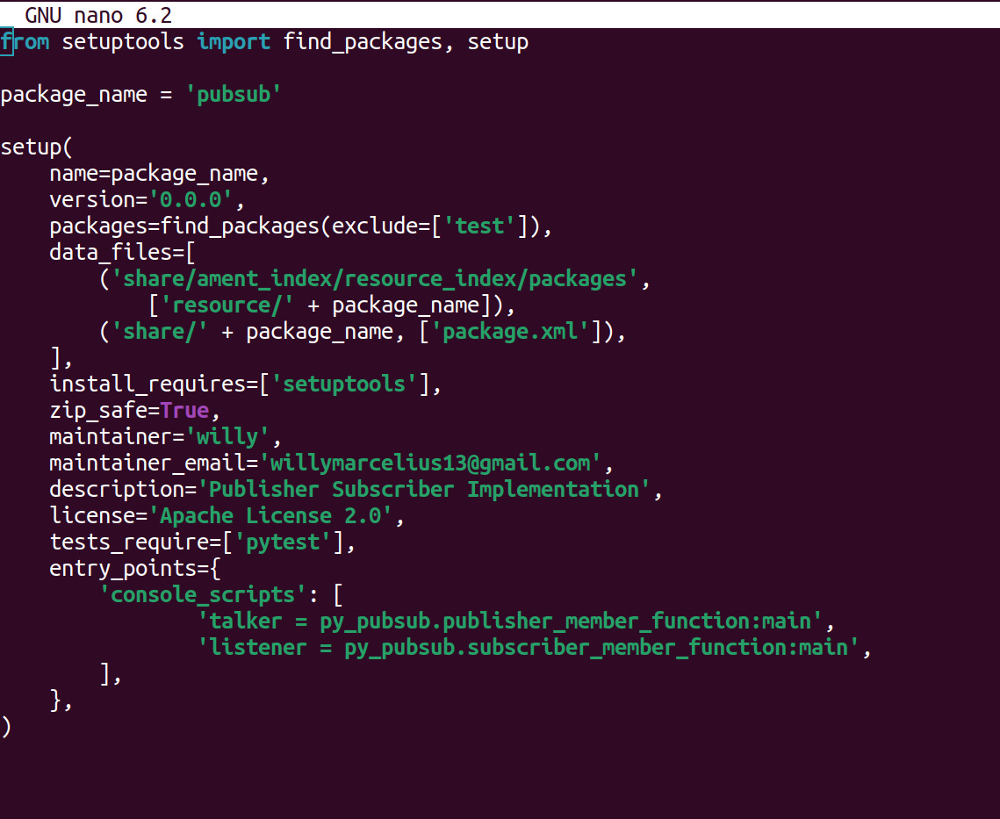
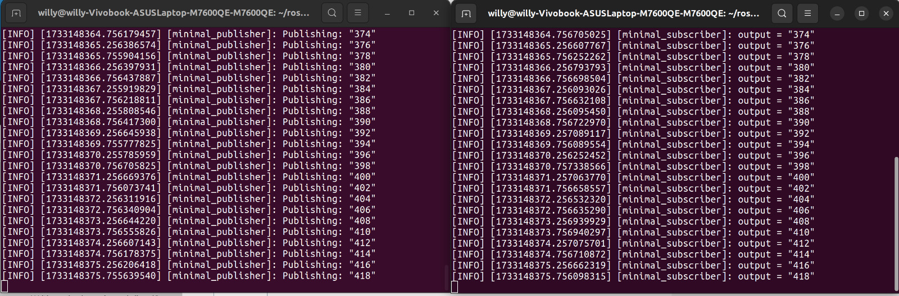

| Nama              | Division  | Sub-Division  |
| ----------------- | ----------| ----------    |
| Willy Marcelius   | PGR       | Vision        |

## Autonomous System Diagram
[Diagram](<diagramroboboat.jpg>)

## Publisher - Subscriber Implementation
1. Membuat package
buka terminal dengan ctrl + alt + t, lalu navigasikan ke workspace yang telah dibuat. Setelah itu navigasikan
ke direktori src, tempat untuk membuat package. untuk membuat package, bisa gunakan command berikut:
```bash
ros2 pkg create --build-type ament_python pubsub
```


2. Navigasikan ke folder ros2_ws/src/pubsub/pubsub lalu jalankan contoh kode publisher berikut:
```bash
wget https://raw.githubusercontent.com/ros2/examples/rolling/rclpy/topics/minimal_publisher/examples_rclpy_minimal_publisher/publisher_member_function.py
```


3. Edit kode
Akan muncul file baru dengan nama publisher_member_function.py, anda dapat edit kode tersebut dengan command berikut:
```bash
nano publisher_member_function.py
```


4. Menambahkan dependensi
Navigasikan ke folder ros2_ws/src/pubsub, buka package.xml dengan command berikut
```bash
nano package.xml
```
kode package.xml seharusnya berisi seperti ini

pastikan mengisi tag <description>, <mantainer>, <license> pada kode. Di baris selanjutnya, tambahkan dependensi dengan
kode di bawah ini
```bash
<exec_depend>rclpy</exec_depend>
<exec_depend>std_msgs</exec_depend>
```

5. Menambahkan kode entry_points
Buka file setup.py, seperti sebelumnya, isi tag <description>, <mantainer>, <license> pada kode. Setelah itu di baris 
tempat entry points tambahkan kode seperti berikut:
```bash
entry_points={
        'console_scripts': [
                'talker = py_pubsub.publisher_member_function:main',
        ],
},
```
setelah itu simpan kode dengan ctrl+o, enter, ctrl+x (jika anda menggunakan nano)
 

6. Cek file setup.cfg
Masih di direktori yang sama, buka file setup.cfg, kode di setup.cfg seharusnya sudah terisi otomatis seperti ini:
```bash
[develop]
script_dir=$base/lib/pubsub
[install]
install_scripts=$base/lib/pubsub
```

7. Tambahkan kode Subscriber
navigasi ke folder ros2_ws/src/pubsub/pubsub lalu tambahkan contoh kode subscriber sebagai berikut:
```bash
wget https://raw.githubusercontent.com/ros2/examples/rolling/rclpy/topics/minimal_subscriber/examples_rclpy_minimal_subscriber/subscriber_member_function.py
```

8. Edit kode Subscriber
untuk mengedit, dapat menggunakan cara yang sama. contoh :
```bash
nano subscriber_member_function.py
```
setelah selesai diedit, jangan lupa untuk simpan kodenya


9. Tambahkan entry_points
Beralih lagi ke folder ros2_ws/src/pubsub dan buka file setup.py, lalu tambahkan kode pada bagian baris 
entry_points seperti kode berikut:
```bash
entry_points={
        'console_scripts': [
                'talker = pubsub.publisher_member_function:main',
                'listener = pubsub.subscriber_member_function:main',
        ],
},
```


10. Menjalankan kode
beralih navigasi ke akar workspace ros2_ws untuk cek dependensi yang kemungkinan hilang, jalankan command berikut:
```bash
rosdep install -i --from-path src --rosdistro rolling -y
```
Masih di akar workspace, lakukan build terhadap package dengan command berikut:
```bash
colcon build --packages-select pubsub
```
Setelah itu, buka terminal baru dan jalani kode berikut:
```bash
. install/setup.bash
```
Lalu jalani kode talker dengan command berikut:
```bash
ros2 run pubsub talker
```

Buka terminal baru, jalani kode setup files yang sama:
```bash
. install/setup.bash
```
Lalu jalani kode listener dengan command berikut:
``` bash
ros2 run pubsub listener
```

Implementasi berhasil dijalankan, dengan output seperti ini:
